## CyberGlitch403 // Welcome to my trials and errors!

## 🛠️ Project 0: Frankenstein CyberPower Revival (Active)

Follow along as I attempt this beautiful Frankenstein build. I am completely new to hardware modification and coding, but I'm diving in headfirst to see exactly how far I can stretch hardware cross-compatibility.

### 🎯 My Learning Objectives & Future Lab Goals

I am repurposing this vintage laptop chassis as my ultimate hands-on classroom. Once I figure out the hardware modifications, my goal is to install a Lenovo T14 Gen 1 AMD Ryzen Pro motherboard, building out a home lab to run advanced cybersecurity labs and practical simulations to continue challenging myself.

#### 🗺️ The Home Lab Roadmap (Work in Progress)

* **Host Operating System:** Proxmox VE / Linux Hypervisor (for spinning up isolated virtual testing environments)
* **Dedicated Routing:** Implementing a dedicated hardware router to segment all home lab testing traffic completely away from the primary home network.
* **Defensive Monitoring:** Deploying active honeypots paired with real-time threat intelligence feeds.
* **Security Operations:** Engineering SIEM (Security Information and Event Management) pipelines and central log aggregation.
* **Simulation Testing:** Creating an automated attack/defense range to safely launch and mitigate adversarial tactics.
* **Network Auditing:** Utilizing IoT and network security auditing frameworks.
* **Advanced Research:** Constructing a completely isolated malware analysis sandbox.

---

🔍 Click here to view the Lab Journal, Costs & Progress

### 📈 Project Ledger (Current Total Cost: $111.81)

| Component / Part | Source | Cost | Status |
| :--- | :--- | :--- | :--- |
| Vintage CyberPower Laptop Chassis | eBay | $54.44 | In Lab |
| Arduino Micro with Headers [A000053] | Amazon | $23.00 | Ordered |
| Horinktor MCP23017 DIP-28 Chip | Amazon | $8.49 | Ordered |
| 24-Pin 1.0mm to DIP 2.54mm Board | Amazon | $8.50 | Ordered |
| MECCANIXITY 10-Pin 0.5mm to DIP 2.54mm Board | Amazon | $8.39 | Ordered |
| MB-102 830-Point Breadboard Kit + Wires | Amazon | $8.99 | Ordered |

---

### 📓 Step 1: The Teardown & Harvest
* **What I Did:** Completely gutted the vintage CyberPower laptop. Carefully saved all the original casing screws, the plastic frame, the screen and the raw keyboard/trackpad ribbon cables. **WARNING!** She was in gnarly shape before I started this process. I bought it 50% for that reason. I love that she has wear and tear. How cool is it to see this wild beat up laptop and it actually operate an amazing system. Plus the vintage `CyberPower` branding completely won me over.
* **Issues / Roadblocks:** The original screen and internal parts are completely ancient and potentially incompatible, creating an incredible troubleshooting opportunity as I attempt to map their connections and see if I can force them to talk to a modern motherboard. I am tackling the keyboard/trackpad first.
* **Current Status:** Moving to the peripheral translation phase.

> 

> 
<b>🛠️ CLICK HERE TO VIEW THE CHASSIS TEARDOWN</b>

>  
>
> [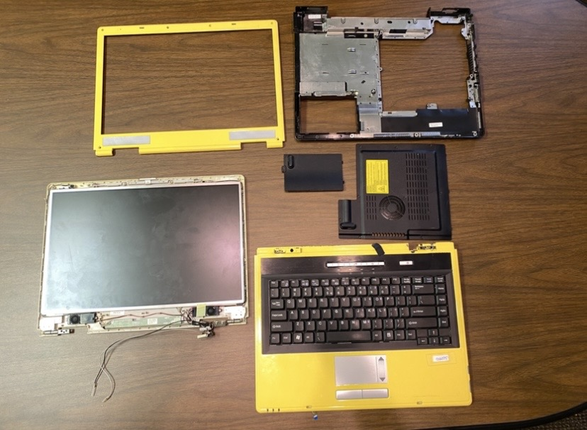](chassis-01.jpg)
> [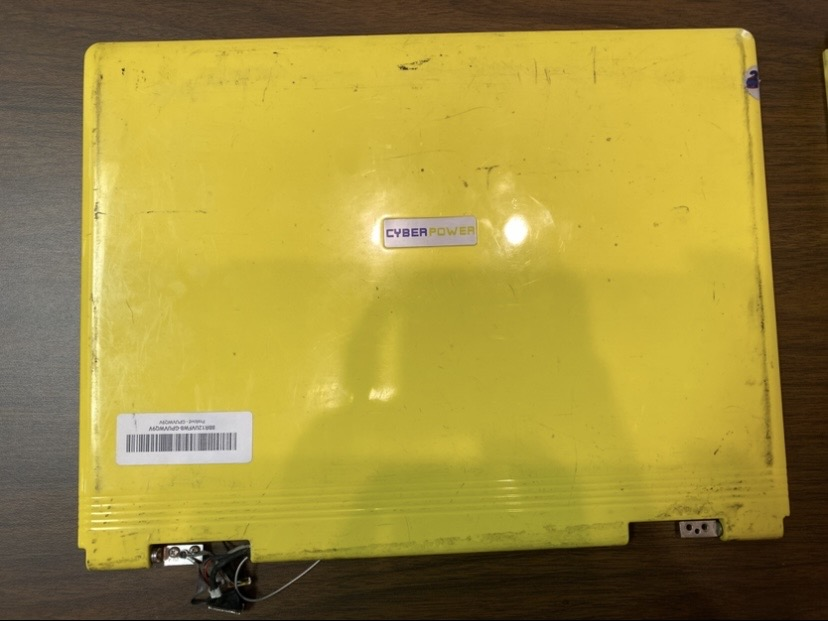](chassis-02.jpg)
> [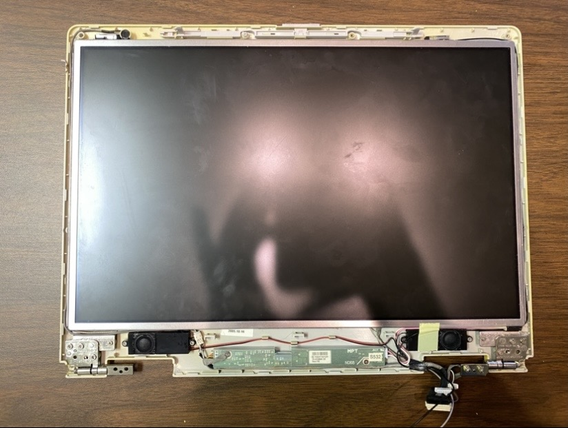](chassis-03.jpg)
> [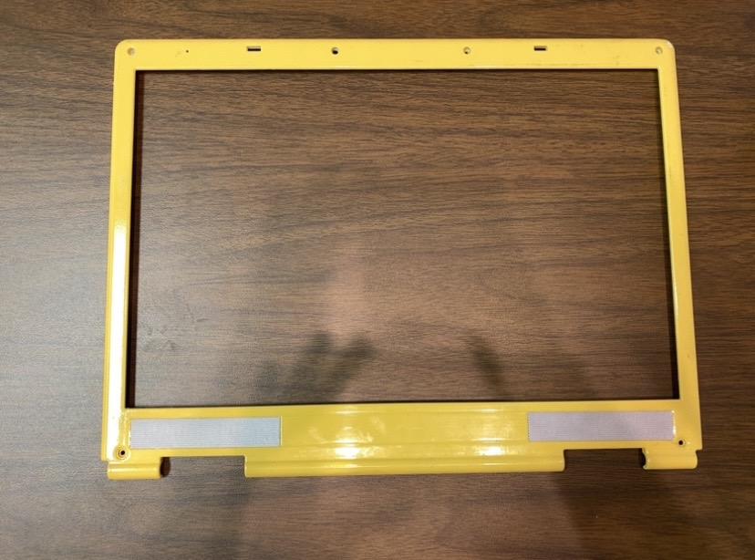](chassis-04.jpg)
> [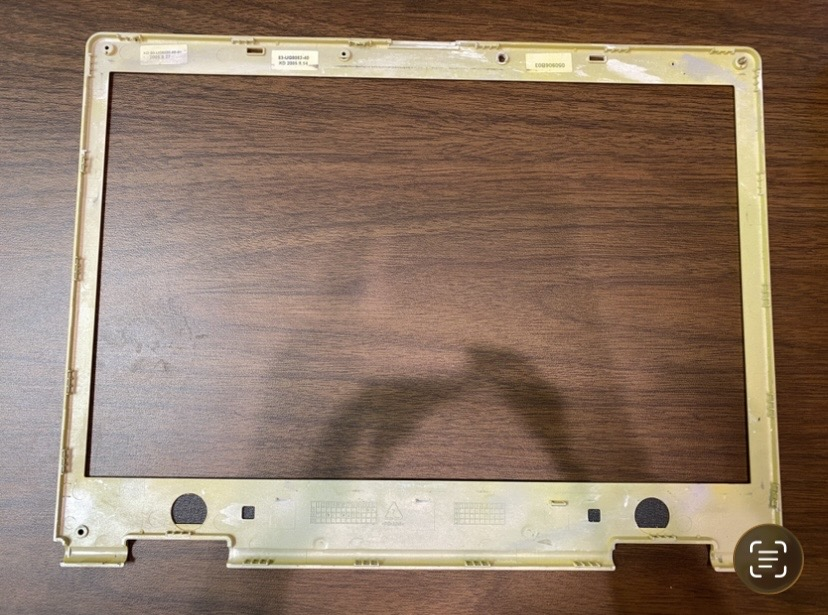](chassis-05.jpg)
> [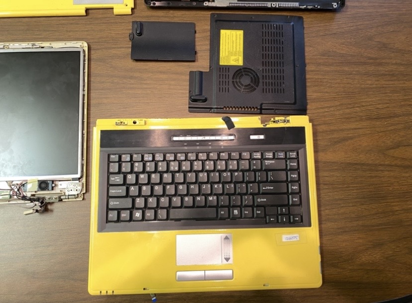](chassis-06.jpg)
> [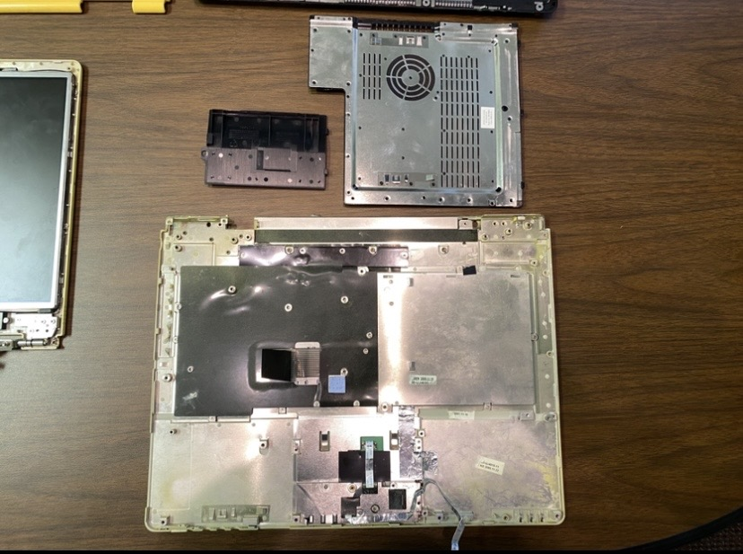](chassis-07.jpg)
> [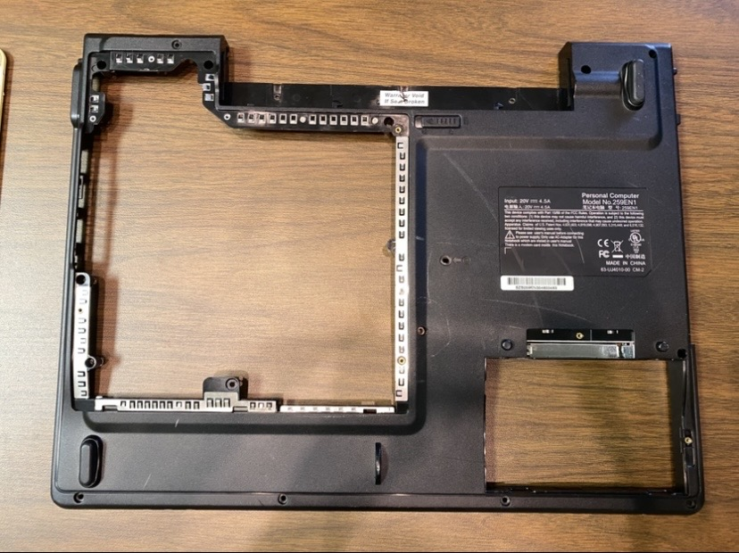](chassis-08.jpg)
> [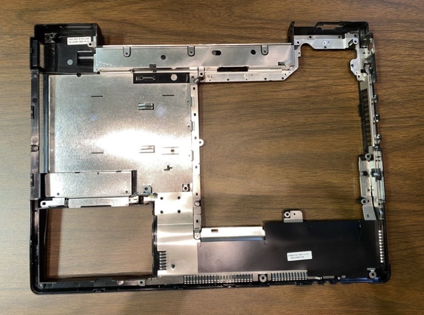](chassis-09.jpg)
> [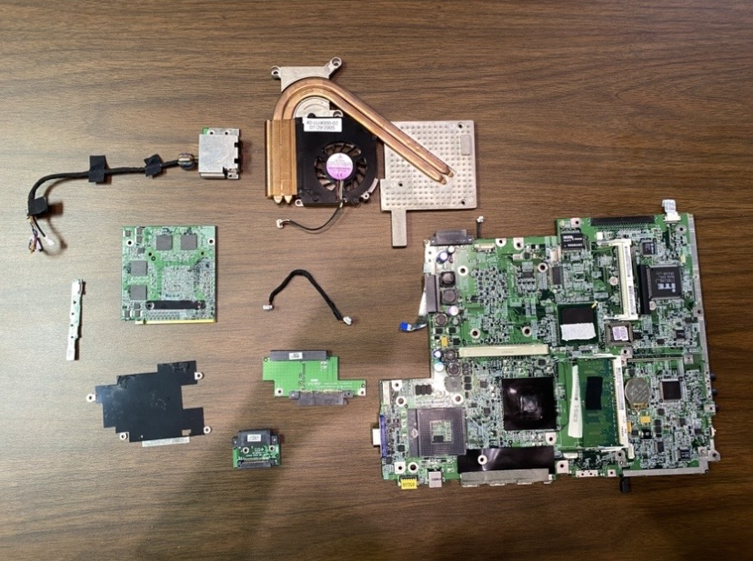](chassis-10.jpg)
>
> 

---

### 📓 Step 2: Architecture Design & Sourcing
* **What I Did:** Measured the vintage ribbon cables (24-pin keyboard and 10-pin trackpad). Discovered the keyboard is 1.0mm pitch and the trackpad is 0.5mm pitch. 
* **Issues / Roadblocks:** Realized the Arduino Micro doesn't have 34 physical holes to plug all these lines into! I had to research how to solve a pin bottleneck before I even bought my parts. I also had to dodge "double-row" adapter boards that would have short-circuited my trackpad on a breadboard.
* **Current Status:** Added a MCP23017 expander chip to my order to give the Arduino extra pins. Everything is officially ordered; waiting for delivery so I can start learning how to wire it up!

> 

> 
<b>📐 CLICK HERE TO VIEW THE ARCHITECTURE & SOURCED PARTS</b>

>  
>
> *Ribbon Cable Reference 1 - Pin counting close-up:*
> 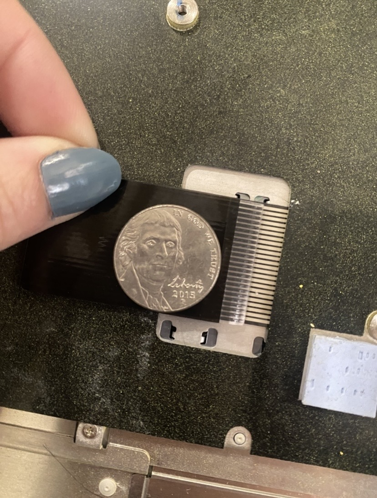
> 
> *Ribbon Cable Reference 2 - Connector orientation:*
> 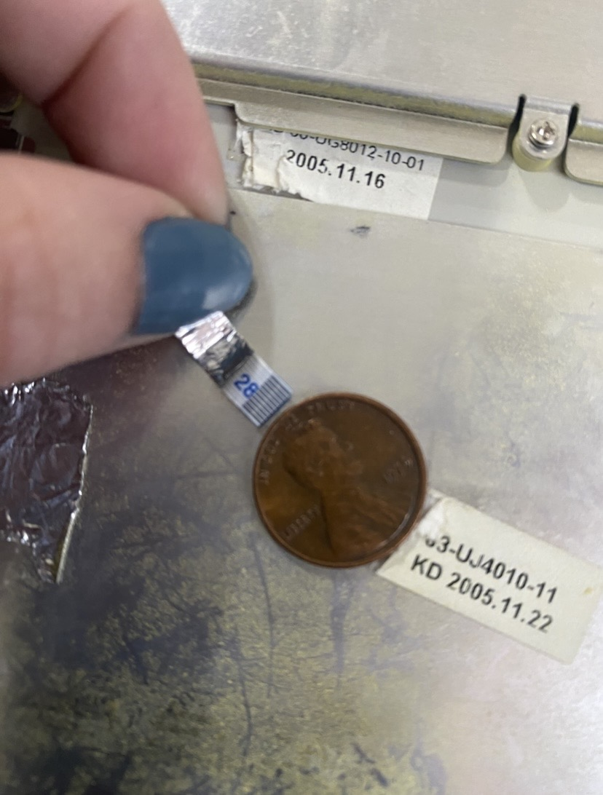
>
> *The ingredients have arrived in the lab! Ready for the breadboard:*
> 
>
> 

---

### 📓 Step 3: Breadboard Arrival & Learning to Code (Next Phase)
* **What I Did:** 
* **Issues / Roadblocks:** 
* **Current Status:**

> 

> 
<b>⚡ CLICK HERE TO VIEW BREADBOARD TESTING & ENCODING SUCCESSES</b>

>  
>
> *First prototype wiring layout on the MB-102 breadboard:*
> 
> 
> *Proof of concept! Capturing our first successful peripheral translation:*
> 
>
> 

---

## 📱 Project 1: BlackBerry Restomod (Zinwa Q25) [Future Phase]

My next upcoming project is a BlackBerry shell modification: retrofitting a Zinwa Q25 platform inside a vintage BlackBerry chassis to explore compact hardware routing.

